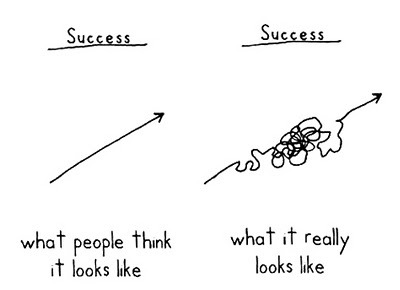

## A letter to self 

Dear Michel

I hope you are doing well. However, if not...it's ok. I am serious, sincerely, please listen, it is __totally ok__. 

You have the right to not feel ok Michel. Being not ok, you know, weirdly, is one hell of a SANE feeling to get as a human being. It means you are, in the present moment, realizing something is wrong, whether it is in your environment or within yourself, whether it is something you can explain or not. Now that this has been said, let's be proactive and examine how you can get out of that feeling of being stuck, and anxious about it.  

Here are some things and strategies to keep in mind:

- You are not stuck forever. You are just not unstuck _yet_. Be proactive and patient. Think growth mindset.  

- Use the 5 Why's method, and follow through with 5 How's, in order to identify the problem and the solution.  

- Have the courage to tell someone knowledgeable you are stuck. Reach out for help.  

- Once you know the problem, deconstruct it. See how you can establish a detailed plan to get unstuck.  

- Search through any useful information site to download new knowledge in your brain, and eventually, make new connections, and solve your problem.  

- Always remind yourself why you are doing what you are doing. Most of the time, when it is tough, it is WORTHWHILE. 

- Write down your very best strengths. How can those help you move forward in the present moment?  

__AND REMEMBER:__

## My career goals - a first draft

1. Adding value by any way I can within companies and organizations that I admire and inspire me.
2. Get hired as a software engineer (especially in the web or mobile services industry), with which I want to learn and fully integrate the full process of professional software development with experienced, senior mentors. 
3. Work in organizations seeking to help humanity improve through technologies and innovation at massive scale.
4. Start a company helping humanity improve through technologies and innovation at massive scale.

I am currently in the process of finding mentors in Quebec City, Canada. This is my hometown and current location.

### particular interests  

My interests are mobile and web services, with a particular interest in the health sector/consumer health. 

I love to learn about everything and I am constantly reading, mostly non-fiction books. Software development, the psychology of human motivation, anything related to business, and preventive medicine are my particular learning interests at the moment. After graduating from the Front End Web Developer Nanodegree, I plan on completing the Machine Learning Engineer Nanodegree and probably another one as well, such as the Senior Web Developer Nanodegree or the Android Developer Nanodegree. I am also working thoroughly on my written and spoken English as well.

## Principles - a first draft  

That being said. Here are some other principles to put you in the right mindset:

1. Be here, now. Breathing, Calmness, Freeing your mind, Thinking, and then Doing...Only...One...Thing...At...A...Time.

2. You will die, so will everyone, and things are never as important as you think they are. Be inspired, but not anxious. Do things lightly, but industriously. 

3. Have a beginner's mind, knowing you still have everything to learn, so you'll have an always learning, zen mind.

4. Meditate daily

5. Exercise daily

6. Talk to people that make you grow and feel loved daily.

7. Smile, Laugh, and Love for any reason. If you can't naturally, fake it until it becomes natural again.

8. Empathize and embrace perspective-taking in every situation.

9. Emotion is your servant, not master. It informs you, but does not teach you, and does not decide you.

10. Beyond first excitements, are grit, focus, discipline, planning, organizing, executing, and keeping the vision alive along the way. SEEK THOSE.

11. Nurture your vision of where you want to go, and where you want humanity to go.

12. Have clear short and long term goals. Deconstruct them and examine them regularly. 

13. Make sure your goals give you goosebumps and make sure it helps humanity-do no harm.  

14. Be led by dreams, not fears. Always push through fear, this is how we grow.  

15. No reason not to love and respect others. __No reason__.  

16. No reason not to be interested and ask questions. __No reason__.  

17. No reason not to share and teach. __No reason__.  

18. No reason not to find what is admirable in every individual - __emphasize the best in everyone__.  

19. No reason to hide from the truth. Always seek it.  

20. No reason not to let others help you [grow faster].  

21. Let no one be your idol, only get principles from the best intellects, hearts, and ideas, from the past and today.

## Sincere thanks
Thank you Udacity for this reflective and enriching exercise.
